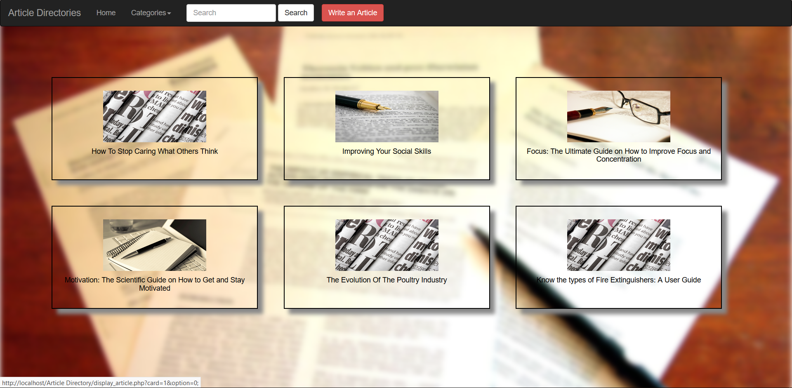
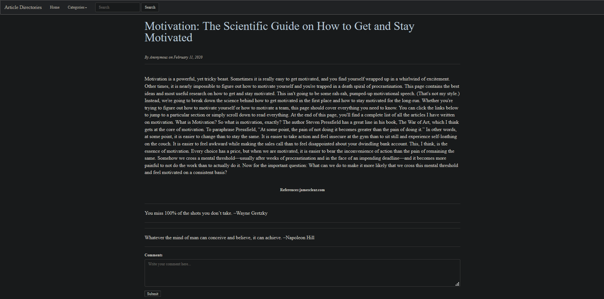
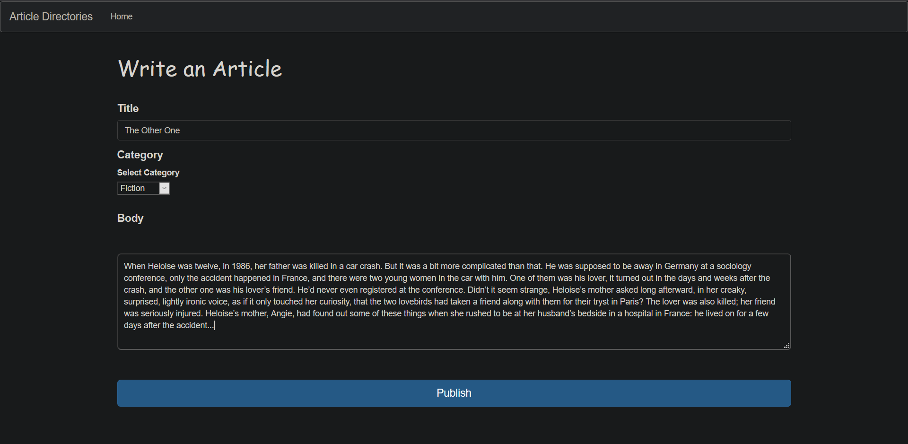

# Article_Directory

Article Directory is similar to a media platform dedicated to posting articles among the community.  
The community can leave feedbacks via comments for any article they come across.  
The homepage displays the most recent articles posted in the community.
A basic college project to get familiar with HTML, CSS & PHP.  

1. Most recent Artciles (Home Page):

2. Article page:

3. Publishing page:

